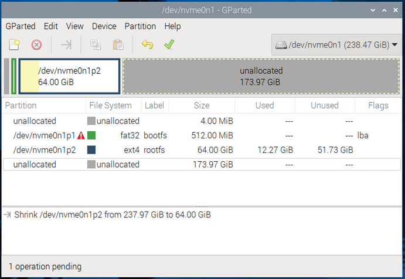
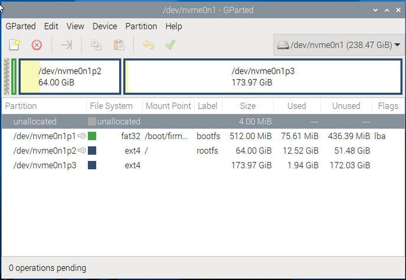
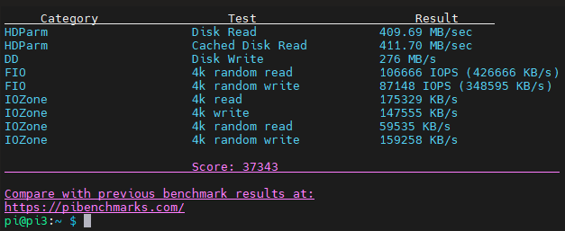
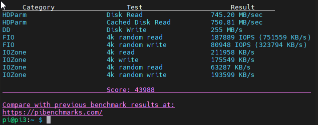

# ecryptfs-on-PI-5 on on NVMe Partition:

Encrypt Home Directory in Raspberry PI 5 NVMe.

The setup ment to have a sperate partition for the home directory in the same NVMe disk and encrypt it using ecryptfs

## Description

Encrypting an NVMe drive on a Raspberry Pi is a good way to protect your data in case the drive is lost or stolen. You can use the Linux built-in encryption tools to achieve this. Here's a step-by-step guide to encrypt your NVMe drive on a Raspberry Pi.

To avoid removing the NVMe every time you install PI OS on it, I prepared the SD card, Install PI OS in it, I insert it (Pi will boot from SD by default) and then I can install PI OS on NVMe drive and partition it in the same time.

### Prepare and partition the NVMe:

You can prepare the NVMe from USB reader of course, It will be similar steps.





After that reboot and remove the SD card, the PI will automatically boot from NVMe.

### Check for updates:
```
sudo apt update
```

### Check for upgrades:
```
sudo apt upgrade
```

### Configure SSH & VNC:
```
sudo raspi-config
```

### Check for firmware update:
```
sudo rpi-eepram-update
```

### edit `config.txt` to overclock PCIe from Gen2 to Gen3

```
sudo nano /boot/firmware/config.txt
```

`dtparam=pciex1`

`dtparam=pciex1_gen=3`

Or use the below one line command to add the lines:

```
sudo grep -q "^dtparam=pciex1" /boot/firmware/config.txt || echo "dtparam=pciex1" | sudo tee -a /boot/firmware/config.txt > /dev/null; sudo grep -q "^dtparam=pciex1_gen=3" /boot/firmware/config.txt || echo "dtparam=pciex1_gen=3" | sudo tee -a /boot/firmware/config.txt > /dev/null
```

Below is a Benchmark test before/after overclicking the PCIe form Gen2 to Gen3.
Benchmark test using https://pibenchmarks.com/
```
sudo curl https://raw.githubusercontent.com/TheRemote/PiBenchmarks/master/Storage.sh | sudo bash
```
Photos show comparison before and after overclocking the PCIe form Gen2 to Gen3.




## Install Required Packages:
